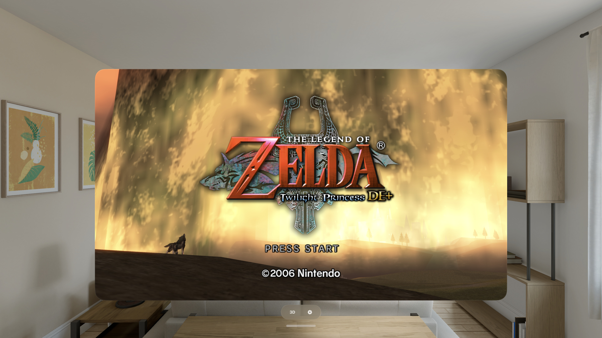

# Dusklight for Apple Vision Pro

Play **The Legend of Zelda: Twilight Princess** on your Apple Vision Pro — the
full GameCube game in a free-floating window, and a stereoscopic **3D mode** that
puts it on a world-locked screen hanging in your room with real depth. Rendered
natively on **Metal** — no emulator, no translation layer. 100% vibe coded with a
lot of passion and attention to detail.

Built on [Dusklight](https://github.com/TwilitRealm/dusklight) (TwilitRealm's
from-scratch, CC0 reimplementation of Twilight Princess) and its
[aurora](https://github.com/encounter/aurora) GX runtime, rendering through
Google's **Dawn** (WebGPU) onto Metal.



---

## Install

**Add the SideStore source** — the easiest path, and the app auto-updates when new
versions ship:

| Device | Source URL |
| --- | --- |
| Apple Vision Pro | `https://raw.githubusercontent.com/rebelancap/dusklight-ios/main/sidestore/apps-visionos.json` |

On **Apple Vision Pro**, first install SideStore onto the headset with my
[iloader fork](https://github.com/rebelancap/iloader/releases#release-visionos)
(upstream iloader doesn't do visionOS — this fork runs on an Apple Silicon Mac and
pairs with the headset over Wi-Fi: no cable, no Dev Strap, no Xcode). Then, in
[SideStore](https://sidestore.io): *Sources → **+** → paste the URL*, and install
Dusklight.

**Prefer a manual install?** Download `dusklight-*-visionOS.ipa` from the
[latest release](../../releases/latest) and install it through SideStore yourself.

Then **add your disc image** (see below) via the **Files** app →
*On My Apple Vision Pro → Dusklight → Documents* → drop the file in.

## You bring the disc

Dusklight ships with **no game content** — nothing copyrighted is included. To
play, you supply your own **GameCube Twilight Princess disc image**: a US
(`GZ2E01`) or European/PAL (`GZ2P01`) dump, as an `.iso` or a compressed `.rvz`.
The disc is read **directly, at runtime** — nothing is extracted, converted, or
copied off your device.

On first launch the app opens a disc-picker screen and waits until it sees a valid
disc. Drop your image into the app's folder (Files → *On My Apple Vision Pro →
Dusklight → Documents*) and it loads everything it needs straight from the disc.

Your **memory-card saves** and settings live alongside the app's data and are
never touched when you swap discs.

## Texture packs

Dusklight's aurora runtime supports **Dolphin-format HD/4K texture packs** — the
same replacement-texture format Dolphin uses. Drop an unpacked pack into
*On My Apple Vision Pro → Dusklight → Documents → **texture_replacements*** and
relaunch.

> **Vision Pro has the GPU headroom for 4K**, and the headset's high effective
> resolution is where a pack earns its size. Bigger packs cost memory, though —
> install one at a time and prefer packs that ship **compressed** (BC7/ASTC/DDS)
> textures over huge uncompressed PNGs, which are clamped on-device to stay within
> the memory budget.

Options: **[TP Definitive Edition+](https://gamebanana.com/wips/90597)**, [Henriko's TP 4K](https://www.henrikomagnifico.com/zelda-twilight-princess-4k)

## Features

- The **full Twilight Princess** — the whole GameCube game, rendered natively on
  Metal (GX → aurora → Dawn/WebGPU → Metal), with GameCube **memory-card saves**
- **Runtime disc loading** — the disc image is read in place; no PC tools, no
  extraction, no companion app
- **Game controllers** — plays great with any paired gamepad
- **60 / 90 / 120 Hz** — auto-detects your headset's panel (M5 Vision Pro runs up
  to 120)
- A **free-resizing 2D window** rendering at high resolution — grab a corner and
  make it as big as the room allows
- **Stereoscopic 3D mode** — the game on a world-locked panel floating in your
  room (mixed immersion), everything live-tunable while you play:
  - **Foveated rendering** — eye-tracked, so the panel is as crisp as the flat 2D
    window and sharpest exactly where you're looking, at no frame-rate cost
  - **Spatial audio anchored to the screen** — the sound comes from the panel, not
    your head (or switch to head-locked if you prefer)
  - **Stereo depth** — how much the world pops out of the panel
  - **Screen size, distance, and height** — reshape the panel to any aspect and it
    re-renders at that aspect (true widescreen FOV, no stretching), live as you drag
  - **Surroundings dimming**, and **press the Digital Crown to recenter** the
    screen and sound together

## Requirements

- **Apple Vision Pro** (visionOS 2 or later)
- A sideloading tool — [SideStore](https://sidestore.io), installed on the headset
  via my [iloader fork](https://github.com/rebelancap/iloader/releases#release-visionos)
  (needs an Apple Silicon Mac)
- Your own GameCube Twilight Princess disc image

## FAQ

**Is any game content included?** No. You supply your own disc image; nothing
copyrighted ships with the app, and nothing is extracted off your device.

**Which disc do I need?** A GameCube Twilight Princess dump — US (`GZ2E01`) or
European/PAL (`GZ2P01`), as an `.iso` or a compressed `.rvz`. (Wii Twilight
Princess is a different game and isn't supported.)

**Do I need a PC to prepare anything?** No — the disc is read directly on the
device. Just drop it in via Files.

**iPhone or iPad?** This port is focused on Apple Vision Pro. Upstream Dusklight
has its own desktop and iOS builds; this repo is the Vision Pro port.

**The app stopped launching after about a week?** Apps sideloaded with a free
Apple account expire after 7 days (paid developer accounts last a year).
SideStore refreshes them automatically in the background — open SideStore and let
it re-sign.

**Found a bug, or it crashed?** The app keeps its own logs, and its folder is
visible in **Files** — open *On My Apple Vision Pro → Dusklight* and grab:

- `crash.txt` — a backtrace, written if the app died (this is the important one)
- `logs/` — the newest `.log` file

Attach those to a [GitHub issue](../../issues) along with what you were doing and
whether a texture pack was installed. A crash without `crash.txt` is usually the
app being killed for memory — worth saying so, and which area you were in.

---

## Building from source

Requires macOS with Xcode (visionOS SDK), `cmake`, `ninja`, and a Rust **nightly**
toolchain (the `nod` disc reader is Rust; visionOS ships prebuilt `rust-std` on
nightly, so no `-Z build-std`).

```sh
scripts/bootstrap.sh           # clone upstream @ pinned commit + apply the overlay
scripts/build-vision-sim.sh    # visionOS Simulator (arm64)
scripts/build-visionos.sh      # Apple Vision Pro device build
```

Upstream Dusklight is vendored **unmodified and pinned by commit** — not checked
into this repo; `bootstrap.sh` fetches it. Every local change is a reviewable
overlay patch in `overlay/patches/`, applied by `scripts/apply-overlay.sh`. Each
patch is produced by a generator in `scripts/gen-patch-*.py` that asserts its
match counts, so a silent no-op edit fails the build. The visionOS app shell
(SwiftUI scene, immersive render loop, settings sheet) lives in `app/visionos/`.

First build is slow: **Dawn has no prebuilt xrOS package and is compiled from
source** (~2000 objects). Subsequent builds are incremental.

## Credits & license

- [Dusklight](https://github.com/TwilitRealm/dusklight) by **TwilitRealm** — the
  from-scratch Twilight Princess reimplementation this port is built on, released
  under **CC0-1.0** (public-domain dedication)
- [aurora](https://github.com/encounter/aurora) — the GX/PAD/DVD/CARD runtime;
  [Dawn](https://dawn.googlesource.com/dawn) (Google's WebGPU), [SDL3](https://www.libsdl.org),
  and [`nod`](https://github.com/encounter/nod) — the platform and disc layer
- THE LEGEND OF ZELDA: TWILIGHT PRINCESS © **Nintendo**. This project is not
  affiliated with or endorsed by Nintendo, and ships no Nintendo content; you
  supply your own disc.

> **A note on authorship.** This is an AI-assisted downstream port. Upstream
> Dusklight asks that contributions not be AI-generated — so nothing here is
> offered upstream: no PRs, no issues, no patches. Upstream is only ever vendored
> and pinned, never modified in place. This repo is a self-contained Vision Pro
> port and stands on its own.
